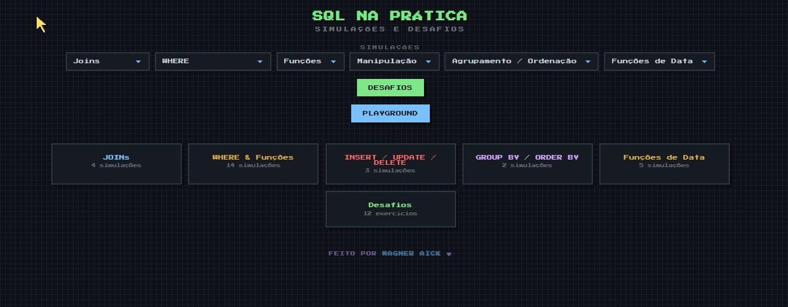
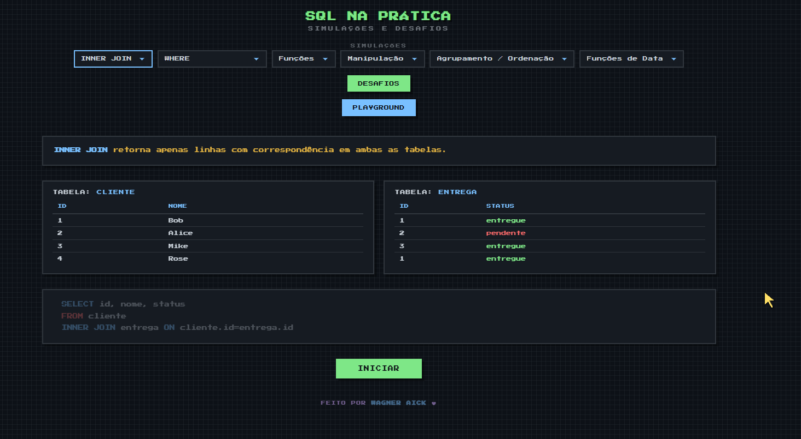
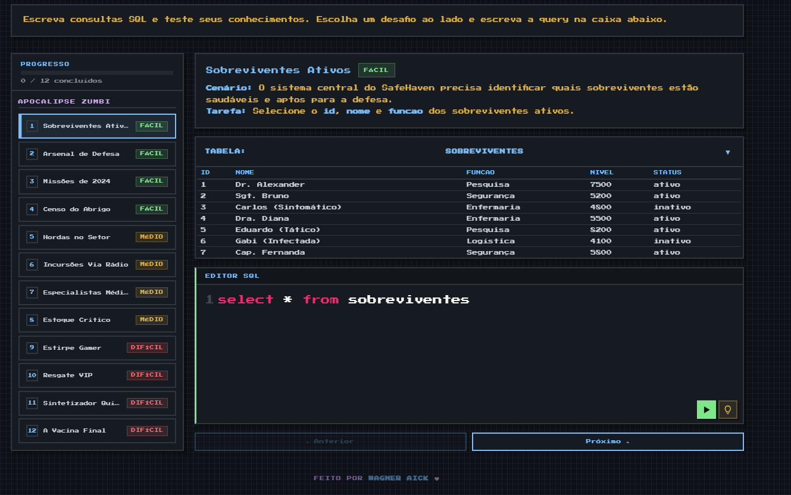

# SQL NA PRATICA (Simulador SQL)

Simulador de consultas SQL, com animações, desafios e editor de código exclusivo com tema retrô 8-bit.

Acesse clicando neste [link](https://aickwagner.github.io/SQL-NA-PRATICA/) ou faça o download do arquivo localmente. 

Trata-se de uma página web interativa, onde o usuário pode visualizar simulações e animações de comandos e funções do SQL, como Join, Where, Group By....

Conta com uma aba de desafios, atualmente com 12 missões contextualizadas que unem alguns conceitos básicos de SQL.

O projeto foi criado com a ajuda do OpenCode, e atualmente está em fase de desenvolvimento.

Feito para ajudar estudantes SQL de qualquer nível.
## Recursos

- +20 Simulações em tempo real de querys SQL
- Editor de código único, com animações satisfatórias, formatação de código e feedback real de querys SQL.
- Tema retrô 8-bit
- +8 Desafios de dificuldade fácil, média, e dificil
- Suporte Mobile, com teclado exclusivo e personalizado

Também conta com uma área de Playground, que atualmente está em fase de *Work In Progress.*

## 🚀 Sobre Mim
Sou um estudante de **computação e análise de dados**, apaixonado pelo desenvolvimento de **soluções inteligentes, automatizadas e eficientes** para problemas que exigem dados e raciocínio lógico. 🧠

Meu hobbie favorito é misturar meus conhecimentos para criar projetos que facilitem a vida de todas as pessoas! 😉

## Screenshots

